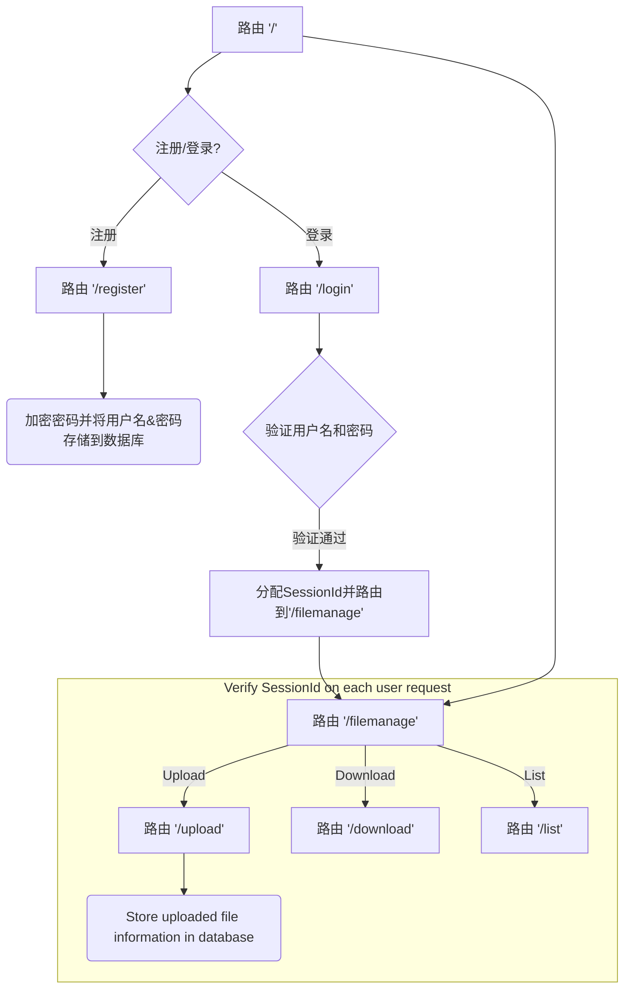
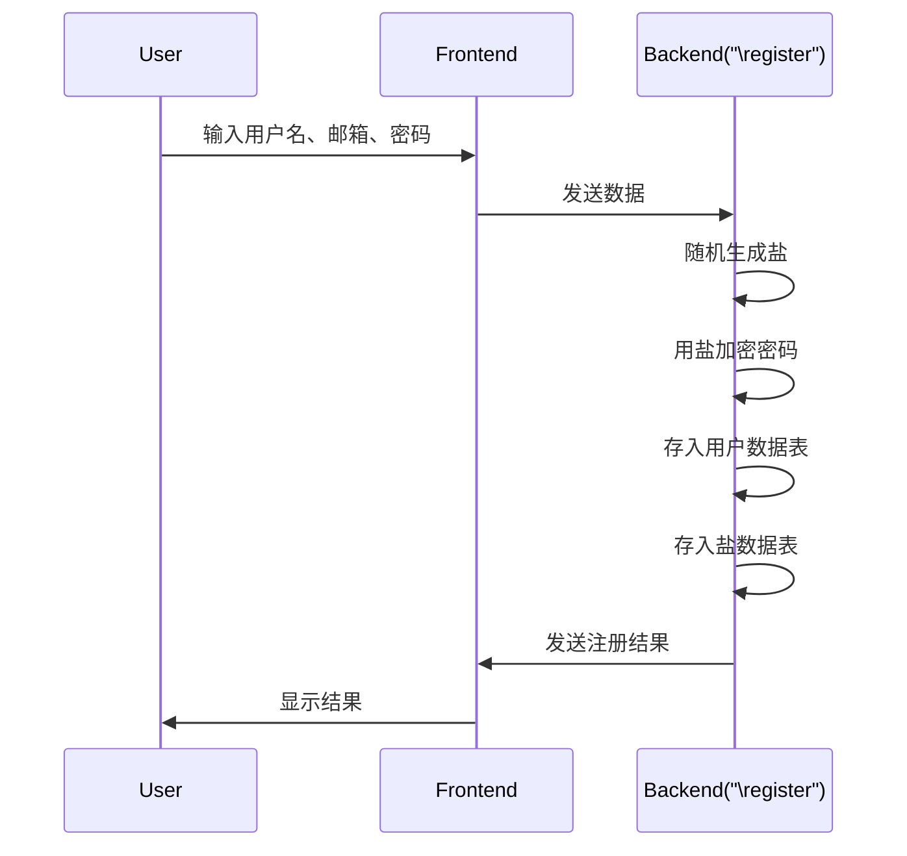
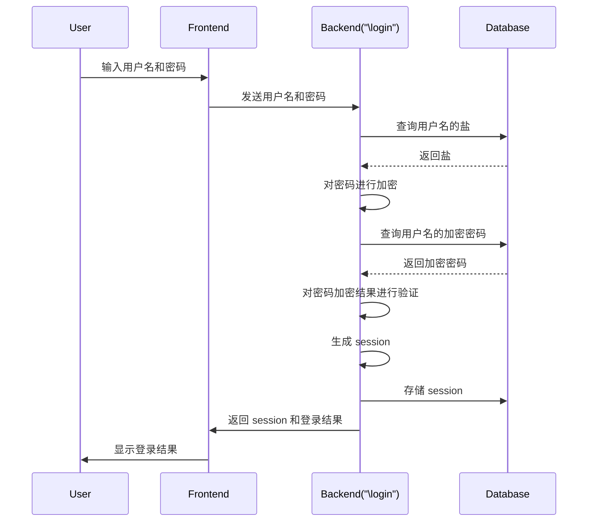
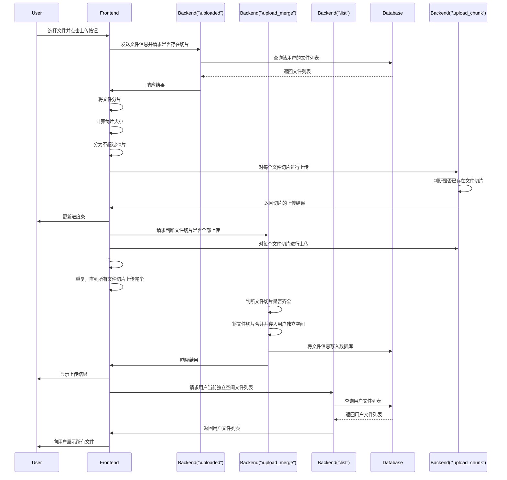
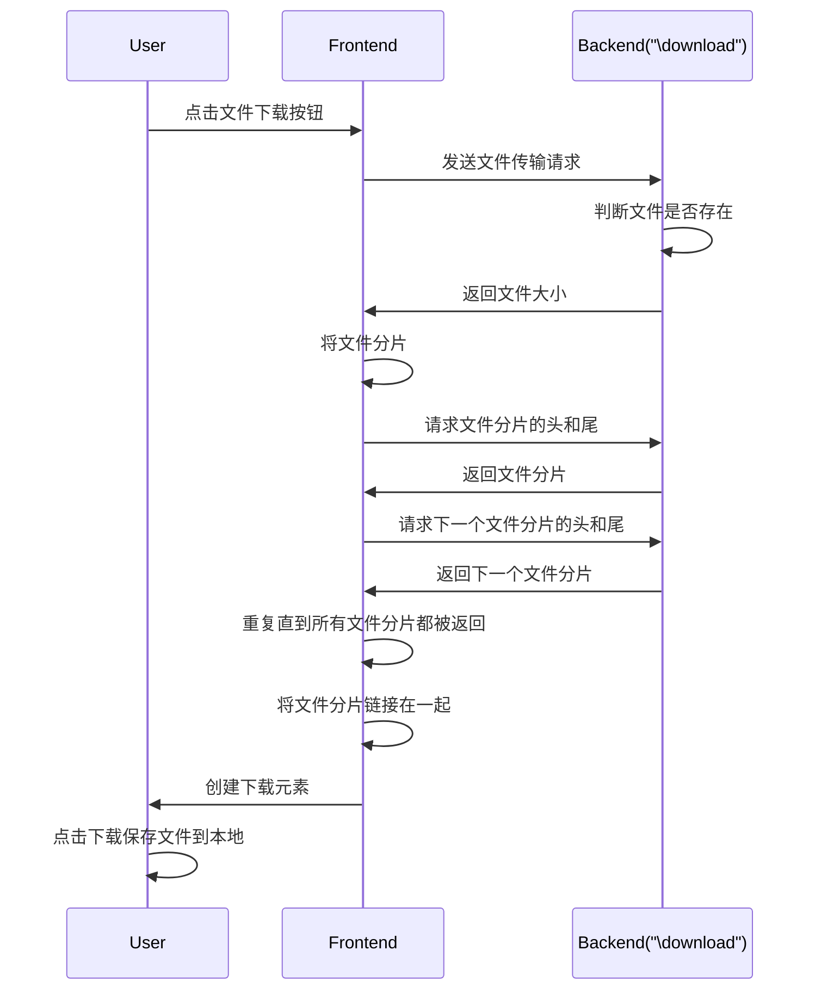

# ArgusDrive-基于HTTPS的安全文件管理系统

## 安全性保证

### 基于HTTPS的中间人攻击防御

本项目使用[Let's Encrypt](https://diamondfsd.com/lets-encrytp-hand-https/)为服务器及域名申请SSL证书，所有网络传输均使用HTTPS进行传输。在通信过程中，HTTPS通过以下流程保证信息的传输不被窃取：

1. 客户端向服务器发起HTTPS请求；
2. 服务器返回证书；
3. 客户端验证证书是否可信；
4. 如果证书可信，则生成随机数并用证书中的公钥进行加密；
5. 服务器用自己的私钥解密出随机数；
6. 双方根据相同的算法生成对称加密所需的密钥；
7. 双方开始使用对称加密算法进行通信

### 基于Cloudflare的DDoS防御

本项目的服务器域名通过Cloudflare平台进行托管及DNS解析，并开启了L7级别的“网站DDoS保护 - Web服务”，通过分析流量，识别和过滤掉恶意流量，同时确保合法流量的性能不受影响。它通过全球285个数据中心智能过滤和分配网络流量，为所有付费计划不限量地吸收OSI模型3、4和7层的流量并缓解DDoS攻击。

### 基于后端加密用户密码的SQL注入防御

项目通过对用户密码的随机加盐加密存储，使得攻击者即使能够访问数据库内容，也难以读取用户的关键信息。项目通过 Bcrypt 使用 Blowfish 加密算法来散列密码，项目启用了eksblowfish最“昂贵”的密钥设置，即使用 128 位盐并加密 192 位的魔法值，这使得攻击者更难使用暴力攻击来猜测密码。

## 系统功能流程图

本项目具有如下功能：

- 用户注册
- 用户登录
- 基于SessionId的身份管理
- 独立用户空间
- 支持分片、断点续传的文件上传
- 支持分片、断点续传的文件下载

本项目的功能流程图如下：

## 各协议时序图

### 用户注册

### 用户登录

### 文件上传

每个前端对后端的请求，后端都有中间层处理并验证SessionId，因篇幅限制，已忽略。

### 文件下载

每个前端对后端的请求，后端都有中间层处理并验证SessionId，因篇幅限制，已忽略。

## 总结

- 实现了一种简单但安全的文件传输协议
- 基于Node.js的并发支持，能多用户并发访问，文件可完整的传输
- 通信全过程可抵御中间人、DDoS、SQL注入等常见攻击

加分功能实现：

- 基于判断服务端文件分片的获得情况，实现了文件的断点续传
- 基于HTTP的SSL加密，实现了对称及非对称的身份验证
- 支持服务端判断用户身份，有根据身份进一步区别处理空间
